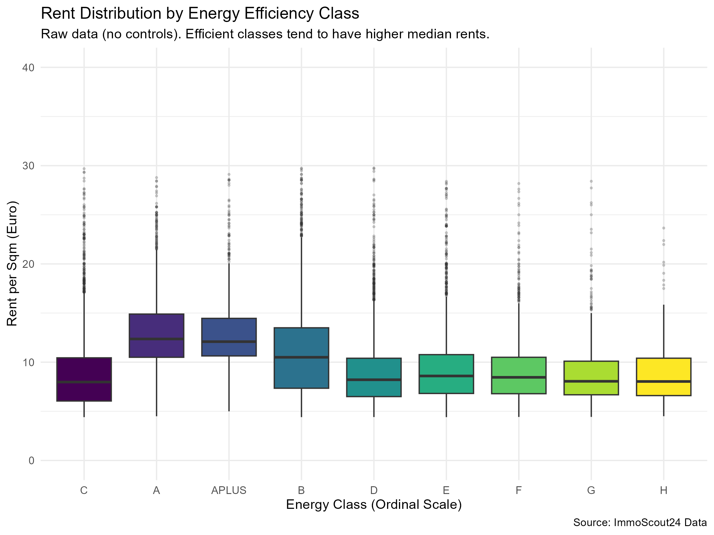
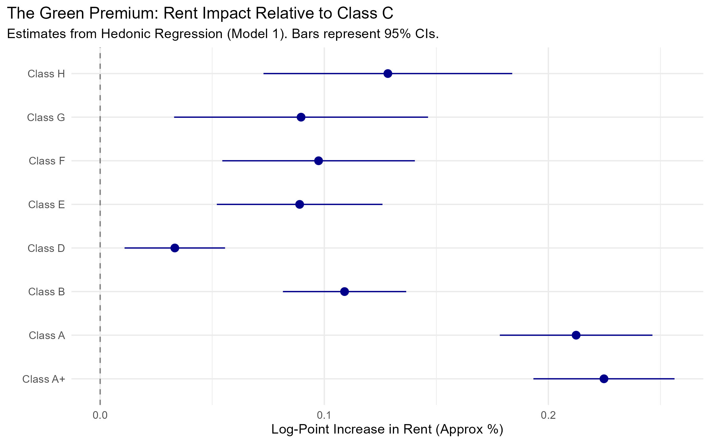
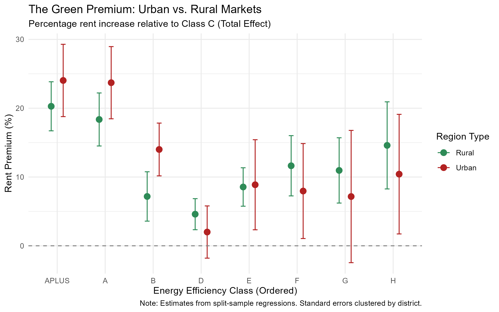

```{r setup}
#| include: false
#| warning: false
#| message: false
library(tidyverse)
library(kableExtra)
library(modelsummary)

# Load the summary table created in Step 02
summary_stats <- readRDS("output/summary_urban_rural.rds")
```


# Introduction

## Research Question

**How is energy efficiency reflected in advertised rental prices for apartments in Germany?**

- Do tenants pay a premium for energy-efficient apartments?
- Does this relationship differ between urban (tight) and rural (loose) rental markets?

## Motivation & Context

- **Rising energy costs:**  
  In 2022, energy prices increased by **34.7%** (Destatis, 2023), making heating costs a key concern for tenants.

- **Market transparency:**  
  Since **2014**, Energy Performance Certificates (EPCs) are mandatory in housing advertisements (BMWi, 2014).

- **Related literature:**  
  - Energy efficiency is capitalized into housing prices in owner-occupied markets (Taruttis & Weber, 2022).  
  - Evidence for the **rental market**, especially regarding **urban–rural differences**, remains limited.


# Data

## Data Source & Sample

- **Data source:**  
  ImmoScout24 (RWI Real Estate Data – Campus File, 2022)

- **Unit of observation:**  
  Individual rental apartment listings

- **Sample construction:**  
  - Cross-sectional dataset  
  - Exclusion of outliers (rent and size)  
  - Removal of observations with missing energy information

## Variables

- **Outcome variable:**  
  Advertised net cold rent per m²  
  $\ln(\text{Rent})$

- **Main explanatory variable:**  
  Energy efficiency class (A+ to H)  
  Reference category: **Class C**

- **Control variables:**  
  - Apartment characteristics: size (m²), rooms, building age  
  - Amenities: balcony, elevator, fitted kitchen, parking, garden
  
## Market Classification

- **Urban markets:**  
  Single-municipality districts (*kreisfreie Städte*)

- **Rural markets:**  
  Multi-municipality districts (*Landkreise*)
  
##Descriptive Statistics (Urban vs. Rural)

```{r}
#| echo: false
#| warning: false
#| message: false

kbl(
  summary_stats,
  col.names = c("Region", "Obs", "Avg Rent (€/sqm)", "Avg Size (sqm)", "Efficient (%)"),
  booktabs = TRUE,
  caption = "Summary Statistics by Region"
) %>%
  kable_styling(font_size = 7, latex_options = "hold_position")
```

## Key Observations

- **Rental prices:**  
  Urban rents are higher on average (€10.0 vs. €9.5 per m²).

- **Energy efficiency:**  
  Rural markets exhibit a higher share of energy-efficient apartments (31.9% vs. 27.8%), likely reflecting newer building stock.


# Methodology

## Identification Strategy

### Conceptual Framework
- Apartment rents are determined by structural characteristics, amenities, and location.
- Energy efficiency is treated as a **quality attribute** valued by tenants.

### Key Assumption
- Conditional on observable characteristics (size, age, amenities, and location), remaining rent differences are associated with energy efficiency.

### Estimation
- Ordinary Least Squares (OLS)
- Robust standard errors clustered at the district level

## Econometric Model

We estimate the green premium using a hedonic rent regression:

$$
\ln(\text{Rent}_i) = \alpha + \beta \, \text{EnergyClass}_i + \gamma \mathbf{X}_i + \delta_d + \varepsilon_i
$$
## Model Components

- $\ln(\text{Rent}_i)$: Log rent per square meter  
- $\text{EnergyClass}_i$: Energy efficiency class dummies (A+ to H), reference category **C**  
- $\mathbf{X}_i$: Apartment characteristics and amenities (age, balcony, elevator, etc.)  
- $\delta_d$: District fixed effects (controlling for local price levels)

# Results

## Descriptive Evidence (Raw Data)

Before controls, we see a clear correlation: Better energy classes are associated with higher rents.

{width=85%}

## The Green Premium (Regression Results)

After controlling for confounders, the premium remains significant.

* **A+ / A:** Significant premium (Tenants pay ~15-20% more).
* **F / G / H:** Significant discount (Tenants pay less).

{width=85%}

## Heterogeneity: Urban vs. Rural

Does the market tightness matter?

* **Urban (Red):** Steep gradient. High willingness to pay for efficiency.
* **Rural (Green):** Flat gradient. Efficiency has little impact on price.

{width=85%}

# Discussion & Conclusion

## Limitations
- **Cross-Sectional Data:**  
  - We observe a snapshot in time.  
  - We cannot observe rent changes for the same apartment (no causal interpretation).  

- **Omitted Variable Bias:**  
  - Unobserved quality (e.g., "luxury" status) might correlate with energy efficiency.  

- **Offer vs. Transaction:**  
  - We analyze advertised rents, not final signed contracts.  

## Key Findings & Policy Implications
- **The Green Premium is Real:**  
  - Energy efficiency is capitalized into rental prices.  

- **Market Heterogeneity:**  
  - The effect is largely driven by Urban markets.  

- **Policy Implications:**  
  - **Urban:** Market forces naturally reward decarbonization.  
  - **Rural:** The market signal is weak. Government subsidies are critical to incentivize renovations.  

## Thank You!
- Questions?

# Group 1: Ahmed Amasha & Begüm Akyüz


**Group 1:**  
Ahmed Amasha & Begüm Akyüz

